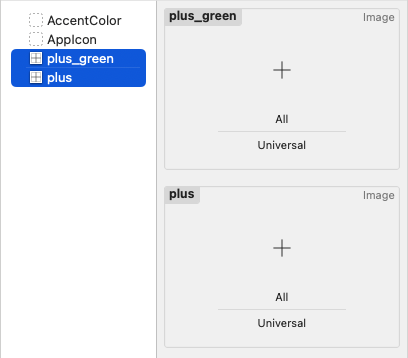

# SVG Color Issue

Why do Xcode / iOS / macOS see colors in an SVG file differently than the Finder or Inkscape?

## Primary Objective

I wanted to create a dark mode image from an existing SVG using [Inkscape](https://inkscape.org), but apparently Xcode does not honor the color change (whereas the Finder does).

## UPDATE:

There is a discussion about this on the [Inkscape Forums](https://inkscape.org/forums/questions/svgs-import-but-dont-display-correctlyfully/?c=70115#c70115).

## The Setup

I am using a simple image here as sample: 

Then, using Inkscape, I colored this image green: 

Notice that your browser should be displaying this plus sign in green. The same goes for the Finder, when you look at the file in QuickLook. Further, these images are taken directly from the sample project.

When you open the sample project and look at the assets, you will notice that the images look identical:



This does not change when inspecting the images in a preview canvas, or running the app on a platform of your choice.

## Who is the culprit?

Inspecting the original [plus.svg](SVGSample/Assets.xcassets/plus.imageset/plus.svg#L2), we can see that the color is specified as `fill="#262626"`. In the [plus_green.svg](SVGSample/Assets.xcassets/plus_green.imageset/plus_green.svg#L39) which has been added using Inkscape, this attribute is still present, and new attributes have been added:
```
     fill="#262626"
     id="path1"
     style="fill:#008000" />
```

Apparently, Xcode, iOS and macOS still use the `fill` attribute, whereas Safari and the Finder will use the `style` attribute.

My knowledge of svg markup is limited, so I have no idea who is responsible. Here is my list of suspects so far:

* **Inkscape**, because it is not setting the color correctly
* **Xcode and Apple SDKs** because it is not reading the `stlye` attribute
* **The original image**, because it indroduced an outdated atttribute

The original file does not specify an svg version, and I have no idea how it was exported or created. In this trivial example I could remote the `fill` attribute, or change it accordingly. In my real app, the images are much more complex, and I would rather just have Xcode use the colors which I have set in Inkscape.

If you have any idea what the issue is, or if there is a feature in Inkscape that will produce a file which is read correctly by Xcode and the SDKs, please let me know.

## Afterthoughts

This seems to be another issue where different part of the Apple OS uses a different renderer for the same thing, an issue I first discorverd with MP3s. Then I found at least four different decoders in various parts of macOS and Apple apps, which I could tell because each of them would play a different kind of non-standard MP3s.


